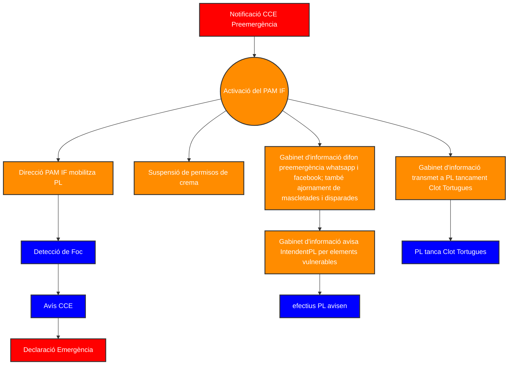
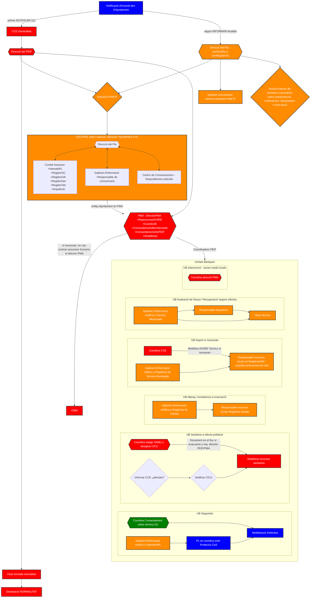

# PREEMERGÈNCIA INCENDIS FORESTALS

## 4.1.1. Actuacions en preemergència
Una vegada rebuda la notificació de la preemergència de nivell 3 la **Direcció del Pla** activarà el PAM IF i s'adoptaran les següents 
<details>
<summary>MESURES:</summary>

- L'ajuntament, en concret el  **gabinet d'informació**, difondrà la informació sobre el nivell de la preemergència i recordaran les mesures preventives d'obligat compliment contemplades en el Reglament de la Llei 3/1993, Forestal de la Comunitat Valenciana, sobre mesures generals per a la prevenció d'incendis forestals, a través del grup municipal de Whatsapp i del Facebook de l’Ajuntament
- L'ajuntament suspendrà tots els permisos de cremes atorgats d'acord amb el pla de cremes del municipi.
- La Direcció del PAM IF mobilitzarà a la **policia local** per a realitzar rutes de vigilància dissuasiva en les zones més sensibles del terme municipal i en els diferents elements de risc en la zona forestal i en la interfície urbà-forestal inclosos en el punt 2.5 del PAM IF. La vigilància es realitzarà de la següent manera: En cas de detectar un incendi durant la vigilància dissuasiva o de rebre l'avís d'un possible incendi forestal per part d'algun ciutadà, s'avisarà immediatament al CCE Generalitat trucant al telèfon 1·1·2 Comunitat Valenciana.
- L'ajuntament, en concret el  **gabinet d'informació**, avisarà del nivell de preemergència 3 als responsables dels diferents elements vulnerables en la zona forestal i en la interfície urbà forestal perquè extremen les precaucions. Els avisos es realitzaran de la següent manera: El  **gabinet d'informació** avisa l'**Intendent de Policia Local** perquè enviï efectius i avisi els responsables dels elements vulnerables.
- La Direcció del PAM IF ordenarà el tancament de la zona d’oci del Clot de les Tortugues. D'executar aquest tancament s'encarregarà la **policia local** i serà avisada pel  **gabinet d'informació**.
- La **Direcció del PAM IF** ordenarà l’ajornament de les mascletaes i disparades de focs artificials. La suspensió es comunicarà a través del  **gabinet d'informació** al grup municipal de Whatsapp i Facebook de l'Ajuntament
</details>

## 4.1.2. Fi de la preemergència

Les preemergències, pel seu caràcter, no requereixen la declaració de la seua fi, considerantse finalitzada la situació quan acaba el termini per al qual es va declarar.

---
---

# PROTOCOL DECLARACIÓ D'EMERGÈNCIA PER INCENDI FORESTAL


## 4.2.1. Actuacions en emergència
L'avís de l'existència d'un incendi forestal, tant en el terme municipal de Picassent, com en el seu entorn pròxim amb el qual hi haja continuïtat de massa forestal, pot provindre d'un particular o de qualsevol mitjà disposat pels organismes que gestionen la vigilància i detecció d'incendis forestals.

Si l'avís arriba primer a l'ajuntament o a qualsevol dels membres que participen en el PAM IF, aquest el notificarà:
- Immediatament al **CCE** Generalitat, a través del telèfon 1·1·2 Comunitat Valenciana, el qual mobilitzarà els mitjans previstos en el PEIF.
- Posteriorment farà arribar l'avís a la **Direcció del PAM IF** a la resta de membres involucrats en el PAM IF mitjançant telefonades de les quals s’encarregarà el **gabinet d’informació**.
- A continuació , la **Direcció del PAM IF**, bé per la seua pròpia iniciativa o a petició del **CCE** Generalitat, activarà en PAM IF en fase d'emergència i realitzarà les següents accions:
  - Convocar al CECOPAL, totalment o parcialment, segons estime oportú
  - Mobilitzar als diferents mitjans i recursos locals, perquè comencen a actuar i si integren en les diferents UB que formen part del PEIF, d'acord amb les indicacions de la **Direcció del PMA**:
    - ---
      - Recursos locals que s'integraran en la <mark>UB d'Intervenció</mark>. El municipi **<u>no disposa</u>** de recursos d’intervenció.
       
        <details>
        <summary>3.9.1. Unitat Bàsica d'Intervenció:</summary>
        
        Funcions:
        - Rebre en primera instància la notificació de l'emergència
        - Combatre l'incendi, auxiliar a les víctimes si escau i aplicar les mesures de protecció per a les persones i els béns que puguen veure's amenaçats pel foc.
        - En la fase inicial assumir funcions i agrupar components de totes les Unitats Bàsiques.
        </details>  
    - ---
    - Recursos locals que s'integraran en la <mark>UB de Seguretat</mark>. El **Gabinet d’informació** avisa a l'**Intendent de la Policia Local** per a que mobilitze efectius i es coordine amb **protecció civil**.
      <details>
        <summary>3.9.2. Unitat Bàsica de Seguretat:</summary>
            
        ```mermaid
            flowchart LR
                A(GC comandament sobre el terreny) -->|Coordina| B(Altres comandaments)
                B --> C(efectius A)
                B --> D(efectius PL)
                B --> E(efectius C)
                style A fill:green,stroke:#333,stroke-width:2px,color:white
                style B fill:blue,stroke:#333,stroke-width:2px,color:white
                style D fill:blue,stroke:#333,stroke-width:2px,color:white
        ```

        Funcions:

        * Mantindre l'ordre públic
        * Garantir la seguretat ciutadana i dels béns
        * Controlar els accessos i acordonar la Zona Operativa / Zona d'Intervenció
        * Ordenar el trànsit (senyalització, corts i desviaments), establir rutes alternatives i facilitar el trànsit de vehicles d'emergències
        * Suport en els avisos i informació a la població
        * Coordinar i executar una possible evacuació
        * Centralitzar la informació sobre l'origen de l'incendi o les seues causes, lesions personals i danys existents, en ser responsable de la instrucció de diligències judicials.
      </details> 
    - ---
    - Recursos locals que s'integraran en la <mark>UB de Sanitària</mark>. Si es detecta que l'incendi forestal poguera tindre una afectació immediata sobre la població, la **Direcció del Pla** informarà el **CCE** Generalitat per a que avise a **CICU**, qui mobilitzarà els recursos sanitaris que hagen d'intervindre en l'emergència actuant en coordinació amb el CCE Generalitat.
        <details>
        <summary>3.9.3. Unitat Bàsica Sanitària:</summary>
        
        FUNCIONS
        - Realitzar les funcions pròpies de classificació, assistència i evacuació de les víctimes a centres
        hospitalaris.
        - Col·laborar amb la Unitat Bàsica d'Intervenció en el salvament de les víctimes.
        - Constituir, si escau, el Lloc d'Assistència Sanitària i Centre / Roda d'evacuació de ferits.
        - Valorar i proposar al Director del PMA la necessitat de l'establiment de l'Àrea de Socors dins de la Zona d'Operacions.
        - Organització dels hospitals de campanya.
        - Valorar la necessitat d'utilització de l'helicòpter medicalitzat.
        - Valorar la necessitat de l'atenció psicològica en l'emergència i activar al Grup d'Atenció Psicològica a través del CCE Generalitat.
        - El Coordinador de la Unitat Bàsica servirà d'enllaç entre el Lloc d'Assistència Sanitària i el CICU, establirà l'evacuació de víctimes a centres hospitalaris, realitzarà la identificació de les víctimes i recollirà tota la informació necessària per a establir actuacions en Sanitat Ambiental, Salut Pública i qualsevol altre aspecte de l'activitat sanitària.
        - Assessorar i coordinar les actuacions a desenvolupar en matèria de Salut Pública.
        - Control sanitari d'aigües i aliments i de les àrees d'evacuats.
        
        COORDINACIÓ:
        El metge del metge del SAMU o el metge designat per CICU.
        
        MITJANS LOCALS:
        - Recursos d'atenció primària del centre de salut de Picassent amb horari de 8:00 a 15:00, 17:00 a 19:00 de dilluns a divendres per consulta habitual i d'urgències mèdiques amb atenció 24 hores.
        - Recursos farmacèutics
        - Recursos de transport sanitari municipals
       
        El CCE Generalitat informa a CICU en tots els incendis que puguen tindre una afectació a la població (situació 1 o superior). Els d'aquesta UB seran mobilitzats al lloc de l'emergència, sempre que es duguen a terme evacuacions i quan la Direcció del PEIF i/o del PMA ho consideren convenient. CICU
        mobilitzarà els recursos sanitaris que hagen d'intervindre en l'emergència actuant en coordinació amb el CCE Generalitat.  

        </details> 
    - ---
    - Recursos locals que s'integraran en la <mark>UB d'Alberg i Assistència</mark>. En aquells casos en els quals l'incendi ocasione l'evacuació de població s'activaran als integrants locals per a participar en aquesta UB, bé per decisió de la **Direcció del Pla**, bé a sol·licitud de la **Direcció del PEIF** o del **PMA**. El **Gabinet d’informació** avisa la Regidora de Sanitat, Infància i Salud Pública per coordinar les operacions.
    
        <details>
        <summary>3.9.4. Unitat Bàsica d'Alberg i Assistència:</summary>
        
        FUNCIONS:
        - Registre i seguiment dels afectats
        - Assistència i suport social als afectats
        - Alberg de les persones evacuades i desplaçades
        - Distribució de queviures en els centres d'evacuació i alberg
        
        COORDINACIÓ:
        La coordinació de la UB es realitzarà segons el que estableix el Pla Especial. A nivell municipal, el
        responsable dels recursos locals serà Regidora de Sanitat, Infància i Salud Pública
        
        MITJANS LOCALS:
        - Recursos dels serveis socials municipals.
        - Voluntaris de protecció civil de Picassent 
        </details>

    - ---
    - Recursos locals que s'integraran en la <mark>UB de Suport</mark>. Segons evolucione l'incendi forestal i les necessitats que sorgisquen per a dur a terme la seua extinció s'activaran als integrants locals per a participar en aquesta UB, bé per decisió de la **Direcció del Pla**, bé a sol·licitud de la **Direcció del PEIF** o del **PMA**. El **Gabinet d’informació** avisa la Regidora d’esports, Servicis Municipals i Cementeri per coordinarse amb **protecció civil** i organitzar les operacions.

        <details>
        <summary>3.9.5. Unitat Bàsica de Suport:</summary>
        
        FUNCIONS:

        En aquesta Unitat Bàsica distingim dos àmbits: el dedicat al suport logístic en l'emergència i el que presta assistència tècnica en l'anàlisi i la gestió de l'emergència.

        **Les funcions en matèria de suport logístic són:**

        * Proveïment d'eines, maquinària i combustible
        * Transport, tant per al material com per a la població a evacuar
        * Avituallament del personal de les Unitats Bàsiques
        * Suport en les comunicacions i enllaç entre el PMA i el CECOPAL
        * Suport a la UB d'Intervenció en l'ús de maquinària.
        * Coordinació de la logística de Bases Aèries.

        **Les funcions en matèria d'assistència tècnica són:**

        * Assessorament tècnic en aspectes concrets relacionats amb l'emergència (tecnològics, mediambientals, forestals, arquitectònics, etc.)
        * Seguiment de l'emergència i proposta de noves mesures de protecció a la població i/o al medi ambient a la Direcció del Pla

        Quan no es constituïsca la Unitat Bàsica d'Avaluació de Danys i Recuperació, la Unitat Bàsica de Suport assumirà les funcions habitualment desenvolupades per aquesta UB; especialment les següents:

        * Neteja i sanejament de les àrees afectades.
        * Restabliment de la xarxa viària.
        * Restabliment dels Serveis Bàsics.

        COORDINACIÓ:

        Les funcions d'aquesta UB seran coordinades pel CCE Generalitat en col·laboració amb els responsables de cada matèria en el PMA. Si es considera necessari, el CCE Generalitat mobilitzarà a personal tècnic de la AVSRE per a assumir aquesta coordinació.

        A nivell municipal, el responsable dels recursos locals serà Regidora d’esports, Servicis Municipals i Cementeri.

        MITJANS LOCALS:

        * Recursos dels serveis municipals i de les companyies subministradores de serveis bàsics (llum, aigua, gas)
        * Brigada d'obres
        * Recursos privats de maquinària d'obres públiques
        * Recursos públics i privats de transport de materials i/o persones
        * Recursos privats de proveïments d'aliments i begudes als quals recórrer per a suplir aquestes necessitats de les UB i dels centres d'alberg en cas d'una emergència La relació d'aquests recursos i la manera de contacte es troba en l'Annex II
        * Voluntaris de protecció civil de Picassent
        * Recursos tècnics de l'ajuntament (arquitecte, enginyer)
        </details> 

    - ---
    - Recursos locals que s'integraran en la <mark>UB d'Avaluació de Danys i Recuperació</mark>. Depenent de quals siguen els efectes causats per l'incendi forestal i les necessitats per a la volta a la normalitat s'activaran als integrants locals per a participar en aquesta UB, bé per decisió de la **Direcció del Pla**, bé a sol·licitud de la **Direcció del PEIF**. El **Gabinet d’informació** avisa als tècnics municipals per coordinar les operacions.

        <details>
        <summary>3.9.6. Unitat Bàsica d'Avaluació de Danys i Recuperació:</summary>
        
        Si l'incendi forestal produïra quantiosos danys, la Direcció del Pla podrà ordenar la constitució d'aquesta Unitat Bàsica. Els danys que poden donar-se poden afectar diferents tipus d'infraestructures, construccions o serveis bàsics, per la qual cosa pot ser necessària la intervenció d'un gran nombre de tècnics dels diferents organismes competents.

        FUNCIONS:

        Avaluar les condicions d'habitabilitat de les edificacions, així com els danys en les obres públiques de la zona afectada per l'emergència i proposar les mesures a adoptar. Les funcions concretes que desenvolupar dependran de la magnitud dels danys i poden abastar totes les que detalla el Pla Territorial d'Emergències de la Comunitat Valenciana.

        COORDINACIÓ:

        Quan estiga activat un pla d'àmbit superior per a abordar la fase de tornada a la Normalitat en el municipi, els recursos locals s'integraran i actuaren d'acord amb el que estableix el Pla Territorial d'Emergències de la Comunitat Valenciana.

        A nivell municipal, el responsable dels recursos locals serà l’**Arquitecte Municipal**.

        MITJANS LOCALS:

        * Recursos municipals del sector de l'arquitectura i l'habitatge
        * Recursos municipals del sector de les obres públiques i infraestructures
        * Recursos d'equips de treball d'execució de projectes de recuperació.
        * Recursos de serveis municipals i de les companyies subministradores de serveis bàsics (llum, aigua, gas)
        * Serveis municipals de neteja i desenrunament.
        * Voluntaris de protecció civil
        
        </details>

        - ---
- Avisar als responsables dels elements vulnerables en la zona forestal i en la interfície urbàforestal que estiguen en la zona de l'incendi, d'acord amb el que s'indica els respectius plans d'evacuació, per a:
    - Adoptar les mesures d'autoprotecció personal per part de les persones que es troben en l'element vulnerable.
    - Es preparen per a un confinament, allunyament o evacuació en funció de l'evolució de l'emergència.
- Nomenar un representant de l'ajuntament per al contacte o presència en el **PMA**.
- Depenent de l'evolució de l'emergència, donar l'ordre de confinament, allunyament o evacuació, d'acord amb el que estableix aquest pla i el PEIF de la Comunitat Valenciana.
- Segons les conseqüències de l'incendi en el municipi, sol·licitar a la **Direcció del PEIF** la declaració de la fase de tornada a la normalitat.
## 4.2.2. Fi de l'emergència i volta a la normalitat

La declaració del final de les emergències es realitzarà segons el que estableix el PEIF.

En tots els casos el final de l'emergència serà transmesa als mateixos organismes i serveis que es van alertar en la seua declaració.

Finalitzada la situació d'emergència, si durant l'incendi s'han produït danys materials, com són l'afectació a edificacions i infraestructures, les conseqüències de les quals no permeten el normal funcionament de la societat, el **Director del PEIF** podrà declarar la fase de tornada a la normalitat que es prolongarà fins al restabliment de les condicions mínimes imprescindibles per al retorn a la normalitat de la zona afectada.

En aquesta fase s'actuarà d'acord amb el que indica sobre aquest tema el PTM d'Emergències o bé el Pla Territorial d'Emergència de la Comunitat Valenciana, desenvolupant-se les accions en ell indicades, i en el qual podran integrar-se els recursos locals inclosos en les <mark>UB de Suport i d'Avaluació de Danys i Recuperació</mark>.
